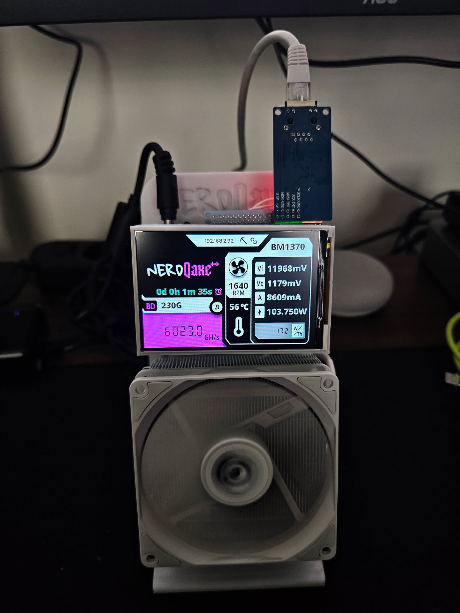
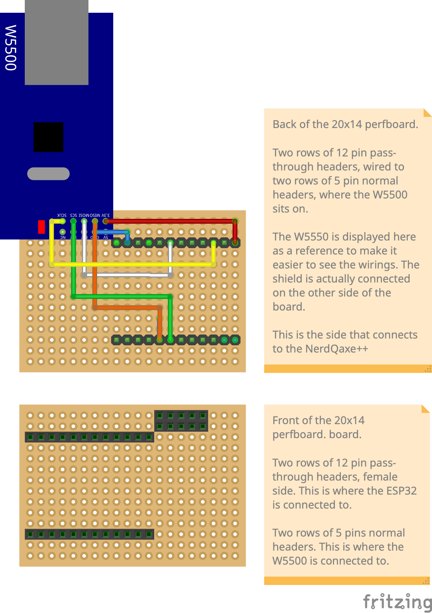

# Clean firmware for 480x320 NerdQAxe++ clones

Open, auditable firmware for the **480x320 (3.5") NerdQAxe++ clones** sold on AliExpress (by sellers such as YYSlupping, among others). These boards ship with a **preinstalled binary firmware whose source isn't published**, so there's no way to see what it does with your pool credentials, payout address, or hashrate. This repo lets you replace it with a clean build compiled from the open [`shufps/ESP-Miner-NerdQAxePlus`](https://github.com/shufps/ESP-Miner-NerdQAxePlus) source — the same firmware the rest of the NerdQAxe community runs — so you know exactly what's on your miner.

| Supported Targets | ESP32-S3           |
| ----------------- | ------------------ |
| Required Platform | >= ESP-IDF v5.3.X  |

On top of upstream (tracking `shufps`'s `develop`), this fork adds:

1. **480x320 (3.5") display support** — the larger panel these clones ship with, which upstream doesn't support (ported from [brunneis/nerdqaxeplus2-3.5-inches](https://github.com/brunneis/nerdqaxeplus2-3.5-inches); upstream has said they won't support this panel, so it's maintained here).
2. **Optional W5500 Ethernet** — add a wired connection if you want one, via upstream's own native `Board::hasEthernet()` / `NetworkManager` support (the community-standard SPI pinout is [below](#ethernet-w5500-wiring)). **It's entirely optional — with no Ethernet shield the firmware runs on WiFi, exactly like stock.**



*This fork running on a 480x320 clone with the W5500 shield installed. The **chain-link icon** at the top of the screen (beside the IP) means it's on a wired Ethernet connection — it's absent when running over WiFi.*

Credits:
- BitAxe devs on OSMU: @skot/ESP-Miner, @ben and @jhonny
- NerdAxe dev @BitMaker
- Upstream NerdQAxe firmware: @shufps

### Status

- ✅ Builds clean for `BOARD=NERDQAXEPLUS2`, target `esp32s3`, with `BIGSCREEN=1` (CI compile-checks every change).
- ✅ **`main/displays/ui.cpp` adapted for the 480x320 canvas.** The SquareLine-Studio layout (written for the 320x170 screen) was scaled to fill the larger panel and verified on a real device — the mining screen, fonts, network/status icons, and the block-found overlay all render correctly.
- ✅ **Ethernet is hardware-verified** on a NerdQAxePlus2 with a W5500 shield: the wiring below is confirmed working and the board runs on Ethernet.

### Ethernet (W5500) wiring

Only 4 signal wires needed, matching the community-standard pinout from CryptoIceMLH's README (plus power/ground):

| Signal | GPIO |
|---|---|
| MOSI | 12 |
| MISO | 16 |
| SCLK | 2  |
| CS   | 21 |



*The W5500 module is drawn on top for reference only; it actually mounts on the opposite side of the board. The 12-pin pass-through header is where the NerdQAxe++ (ESP32) plugs in; the W5500 sits on the 5-pin headers.*

By default INT and RST aren't used — the driver polls, and these W5500 breakout modules reset themselves on power-up. (The firmware pulses GPIO4 as a no-op reset attempt on boot; harmless if unconnected, and overridable via `NerdQaxePlus2::getEthResetPin()`.)

Interrupt mode was hardware-tested: wiring **INT → GPIO11** and building with `W5500_USE_INT=1` works and boots cleanly. The shipped build still polls, though — on a hand-wired add-on shield the interrupt line picks up enough noise to perform *worse* than polling (higher latency/jitter), and the difference doesn't affect mining either way.

## Building this fork

Uses the repo's Docker toolchain, so you don't need ESP-IDF or Node installed locally (the image pins the tested ESP-IDF 5.3.3). **First time only**, build the container:

```bash
cd docker && ./build_docker.sh && cd ..
git submodule update --init --recursive   # if you didn't clone with --recursive
```

Then build — the two fork-specific bits are `BOARD=NERDQAXEPLUS2` and `BIGSCREEN=1`:

```bash
export BOARD="NERDQAXEPLUS2"
export BIGSCREEN=1          # enables the 480x320 display code
./docker/idf.sh set-target esp32s3
./docker/idf.sh build
```

That produces `build/esp-miner.bin` (app) and `build/www.bin` (web UI).

## Installing & updating

Every [Release](https://github.com/AguiMr/nerdqaxe-bigscreen/releases) attaches ready-to-flash binaries (or build your own — see above):
- `esp-miner-factory-NerdQAxe++-<ver>.bin` — full image, for a first-time USB flash
- `esp-miner-NerdQAxe++.bin` + `www.bin` — app + web UI, for in-app / OTA updates

**First install (coming from the stock/unknown firmware): USB serial.** The partition table differs from a stock NerdQAxePlus2 (app partitions enlarged, `www` shrunk for the 480x320 theme assets — see `partitions.csv`), so the first flash can't be done over the air. Hold the `boot` button to enter bootloader mode, then flash the factory image at `0x0`:

```bash
esptool.py --chip esp32s3 -p /dev/ttyACM0 write_flash 0x0 esp-miner-factory-NerdQAxe++-<ver>.bin
# or:  ./docker/bitaxetool.sh --firmware esp-miner-factory-NerdQAxe++-<ver>.bin -p /dev/ttyACM0
```

(From a self-built tree instead: `idf.py -p /dev/ttyACM0 flash` inside `./docker/idf-shell.sh`, or `./merge_bin.sh nerdqaxe+.bin` to produce your own factory image.)

**Updating once you're already on this firmware — no USB needed:**
- **In-app (easiest):** web UI → Settings → **Update via GitHub** → pick the latest release. Preserves your settings (pool, overclock) in NVS.
- **Manual upload:** web UI → firmware upload (`esp-miner-NerdQAxe++.bin`) and website upload (`www.bin`).

> Not on shufps's Webflasher — that only carries upstream builds, not the 480x320 one. Use this repo's own releases.

## Upstream features

This fork tracks `shufps/ESP-Miner-NerdQAxePlus`, so its generic features work unchanged — see the [upstream README](https://github.com/shufps/ESP-Miner-NerdQAxePlus) for full details:

- **Grafana / InfluxDB monitoring** — the firmware supports InfluxDB; upstream ships a Grafana dashboard and compose setup: https://github.com/shufps/ESP-Miner-NerdQAxePlus/tree/master/monitoring
- **Opt-in panic core dumps** — a diagnostic build, enabled by layering `SDKCONFIG_DEFAULTS="sdkconfig.defaults;sdkconfig.coredump"` before `idf.py set-target esp32s3 && idf.py build`. (Upstream's release-CI path for this doesn't apply here — this fork doesn't carry that workflow.) ⚠️ Core dumps can contain pool/WiFi credentials from task RAM, so don't share a raw dump casually.
